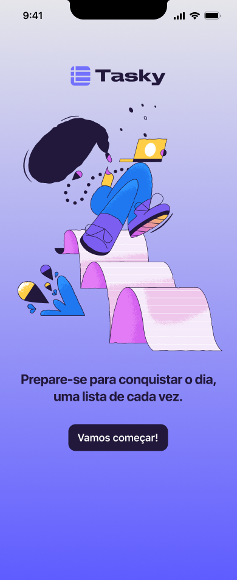
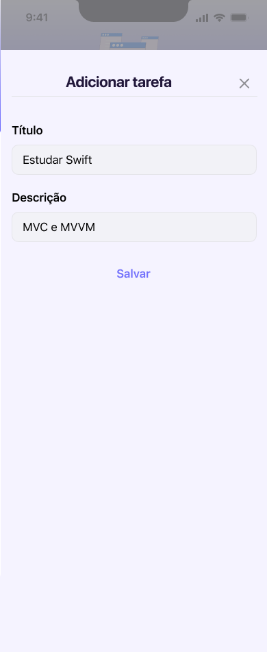

# Tasky App

A simple task list app that allows you to add, remove, and mark tasks as completed, using `UserDefaults` to persist data locally.

## Features

- **Add Tasks**: Create new tasks with a title and description.
- **Remove Tasks**: Delete existing tasks from the list.
- **Mark as Completed**: Toggle tasks as completed or not.
- **Local Persistence**: Tasks are saved locally using `UserDefaults` and persist after closing the app.

## Architecture

- **MVC (Model-View-Controller)**: The base architecture of the project.
- **UserDefaults for Persistence**: The `UserDefaultsPersistence` class implements the `Persistence` protocol to save and load task data using `UserDefaults`.
- **TaskRepository**: Manages task operations, such as adding, removing, and updating task statuses.
- **HomeViewController**: Initial screen of the app, with a start button.
- **TasksViewController**: Task management screen.
- **AddTaskViewController**: Screen for adding new tasks.

## Project Structure

- **`Persistence` Protocol**: Defines the methods for saving and loading data.
- **`UserDefaultsPersistence`**: Implements data persistence using `UserDefaults`.
- **`TaskRepository`**: Centralizes business logic, such as adding, removing, and completing tasks.
- **`HomeViewController`**: The app’s main screen with a "Get Started" button.
- **`TasksViewController`**: Task management screen.
- **`AddTaskViewController`**: Screen to add new tasks.

## How to Run

1. Clone the repository:
    ```bash
    git clone https://github.com/elispethke/TaskApp.git
    ```

2. Open the project in Xcode:
    ```bash
    cd tasky-app
    open TaskyApp.xcodeproj
    ```

3. Run the project on a simulator or an iOS device.

## How to Use

1. On the home screen, click the **Get Started** button to access the task list.
2. On the task screen:
   - **Add a new task**: Click the "+" icon at the top of the screen.
   - **Remove a task**: Swipe the task to the left and click the delete button.
   - **Mark a task as completed**: Click the circle icon next to the task.
3. Tasks are automatically saved and will be available the next time you open the app.

## Screenshots

### Home Screen
This is the main screen where you start managing your tasks:


### Task List Screen
Here you can view all your tasks, add new ones, and mark tasks as complete:


### Add Task Screen
The screen where you add a new task with a title and description:


### Task Completed
This shows the interface after marking a task as completed:


## Technologies Used

- **Language**: Swift
- **UI Framework**: UIKit
- **Persistence**: UserDefaults
- **UI Design**: Auto Layout

## Contribution

Feel free to open an issue or submit a pull request if you want to improve the project or report issues.

## License

This project is licensed under the MIT License. See the [LICENSE](LICENSE) file for more details.
